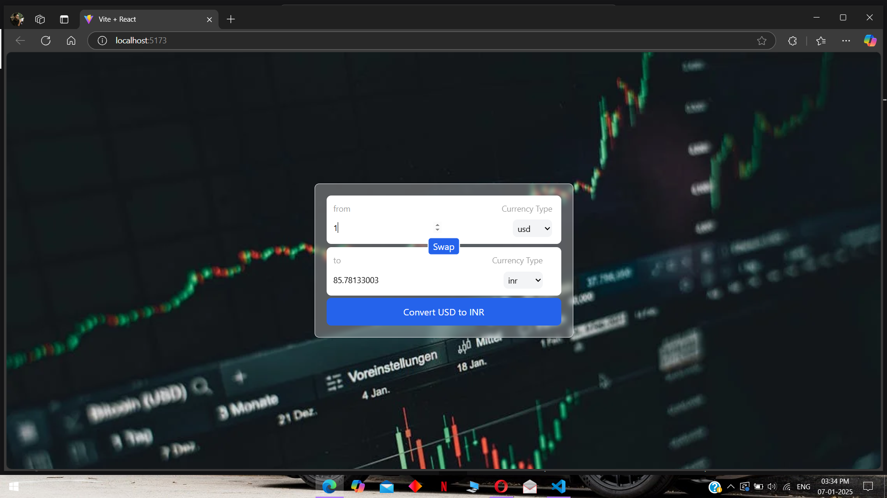

# 🌍 Currency Converter App

A real-time currency conversion application built with React, Vite, JavaScript, and TailwindCSS. This app allows users to quickly convert between multiple currencies with up-to-date exchange rates and an extensive list of currency options.

## 🔥 Features

💱 Real-time currency conversion.
🌎 Supports a wide range of currencies.
🔍 User-friendly interface with a modern design.
⚡ Fast and responsive, thanks to React and Vite.
🎨 Styled beautifully with TailwindCSS.
📈 Reliable exchange rate data fetched from a live API.

## 🛠️ Technologies Used

 ReactJS
 Vite
 JavaScript
 TailwindCSS
 Live Currency API

 📸 Screenshots

 

# ⚙️ Installation and Usage

Follow these steps to run the project locally:

1. Clone the repository:

### `git clone https://github.com/your-username/currency-converter.git`
### `cd currency-converter`

2. Install dependencies:

### `npm install`

3. Start the development server:

### `npm run dev`

4. Open your browser and go to http://localhost:3000.

## Available Scripts

In the project directory, you can run:

### `npm i`

### `npm start`

Runs the app in the development mode.\
Open [http://localhost:3000](http://localhost:3000) to view it in your browser.

The page will reload when you make changes.\
You may also see any lint errors in the console.

### `npm test`

Launches the test runner in the interactive watch mode.\
See the section about [running tests](https://facebook.github.io/create-react-app/docs/running-tests) for more information.

### `npm run build`

Builds the app for production to the `build` folder.\
It correctly bundles React in production mode and optimizes the build for the best performance.

The build is minified and the filenames include the hashes.\
Your app is ready to be deployed!

# 🌟 Future Improvements

Add support for historical exchange rates.
Implement dark mode for better user experience.
Enable offline functionality using service workers.

# 🤝 Contributing

Contributions are welcome! If you'd like to contribute, please fork the repository and create a pull request.

# 📧 Contact

Feel free to reach out for any queries or collaboration ideas:

`Name: Roshan Rafeeque V P`
`Email: roshanrafex24@gmail.com`